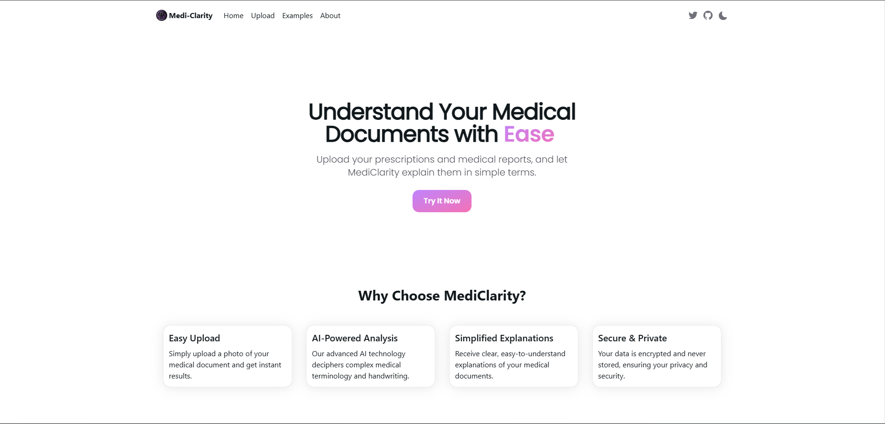

# Medi-Clarity 🏥

[](https://nextjs.org/)
[](https://flask.palletsprojects.com/)
[](https://openai.com/)
[](https://medi-clarity-web-frontend.vercel.app/)

## Overview

Medi-Clarity is an innovative web application designed to bridge the gap between medical professionals and patients by making medical prescriptions and reports more accessible and understandable. Using advanced AI technology, it transforms complex medical documents into clear, patient-friendly explanations.

🌐 **[Live Demo](https://medi-clarity-web-frontend.vercel.app/)**



## Key Features

- **Prescription Analysis**: Upload and analyze doctor's prescriptions
- **Report Interpretation**: Get detailed explanations of medical reports
- **Medication Guide**: Receive comprehensive information about prescribed medications
- **Smart AI Processing**: Powered by GPT-4 for accurate and reliable interpretations
- **User-Friendly Interface**: Modern and intuitive design using NextUI components

## Technology Stack

### Frontend

- Next.js 14.2
- React 18.3
- NextUI Components
- TailwindCSS
- TypeScript

### Backend

- Flask
- Python
- OpenAI GPT-4 Integration
- PIL (Python Imaging Library)

## Getting Started

### Prerequisites

- Node.js (Latest LTS version)
- Python 3.8+
- OpenAI API Key

### Installation

1. **Clone the repository**

   ```bash
   git clone https://github.com/pankil-soni/medi-clarity.git
   cd medi-clarity
   ```
2. **Frontend Setup**

   ```bash
   cd Frontend
   npm install
   npm run dev
   ```
3. **Backend Setup**

   ```bash
   cd Backend
   pip install -r requirements.txt
   # Create .env file and add your OpenAI API key
   echo "OPENAI_API_KEY=your_api_key_here" > .env
   python app.py
   ```

## Usage

1. Access the application through your web browser
2. Upload a medical prescription or report
3. Wait for the AI to process the image
4. Receive a detailed, easy-to-understand explanation

## Security

- All medical data is processed securely
- No prescription data is stored permanently
- API keys are properly secured using environment variables

## Contributing

Contributions are welcome! Please feel free to submit a Pull Request.

## License

This project is licensed under the MIT License - see the LICENSE file for details.

## Authors

- **Pankil Soni** : https://github.com/pankil-soni

## Acknowledgments

- OpenAI for providing the GPT-4 API
- NextUI for the beautiful component library
- The open-source community

---

<p align="center">Made with ❤️ for better healthcare understanding</p>
